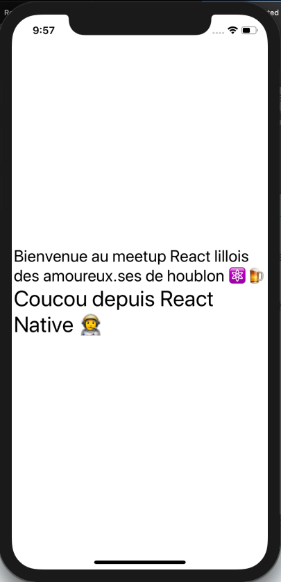

# ReasonReactNative Welcome

This is a sample "Welcome" Project to illustrate the use of ReasonReactNative made for [React Beer Lille #3](https://www.slideshare.net/ThomasHaessle/reasonable-react-with-beers)

## Run Project

You must have [react-native-cli and emulators installed](https://facebook.github.io/react-native/docs/getting-started)

```sh
npm install
npm run bs:build
npm run start:ios
npm run start:android
```



## Usefull links :

- [ReasonML](https://reasonml.github.io/)
- [ReactNative](https://facebook.github.io/react-native/)
- [ReasonReact](https://reasonml.github.io/reason-react/)
- [ReasonReactNative](https://reasonml-community.github.io/reason-react-native/)
